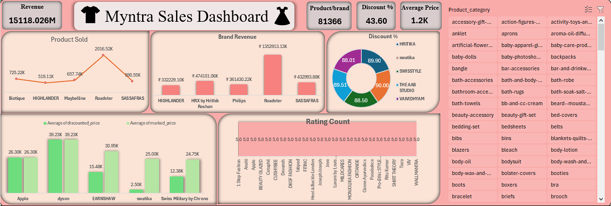

# Myntra

Analyze Myntra product's data and develop an interactive retail analytics dashboard on the basis of category to understand Brand performance & Consumer preference that helps in understanding for better business decision-making.

## Table of Contents

- <a href="#overview">Overview</a>
- <a href="#problem-statement">Problem Statement</a>
- <a href="#dataset">Dataset</a>
- <a href="#tools--technologies">Tools & Technology</a>
- <a href="#data-cleaning-preparation">Data Cleaning & Preparation</a>
- <a href="#exploratory-data-analysis-eda">Exploratory Data Analysis (EDA)</a>
- <a href="#research-questions--key--findings">Research & Key Finding</a>
- <a href="#dashboard">Dashboard</a>
- <a href="#result-&-conclusion">Results & Conclusion</a>
- <a href="#future-work">Future Work</a>

---

<h2>Overview</h2>

This project is a complete retail analytics and dashboarding solution developed using Myntra product data. The workbook transforms raw e-commerce product information into meaningful business insights through data cleaning, KPI generation, pivot analysis, and interactive dashboards. It focuses on analyzing product pricing, discounts, customer ratings, revenue estimation, and brand/category performance to support data-driven decision-making.

---

<h2>Problem Statement</h2>

E-commerce platforms generate huge volumes of product data, making it difficult to manually identify high-performing brands, profitable product categories, customer preferences, and discount effectiveness. The challenge was to organize, clean, and analyze Myntra product data to extract actionable insights and create an interactive dashboard that simplifies business monitoring and strategic analysis. 

---

<h2>Dataset</h2>

CSV file located in `/Data/` folder (RawData)

---

<h2>Tools & Technology</h2>

- Excel
- SQL
- Github 

---

<h2>Data Cleaning & Preparation</h2>

- Removed unnecessary column such as:-
    * image_link
    * sizes
    * product_link
- Removed transaction with:-
    * rating_count = 0
    * duplicate product_ID
- Created columns for markdowns comparable:-
    * Discount% (normal price turns into less than from approx value)
    * Revenue (convert raw popularity into business-relevant)

---

<h2>Exploratory Data Analysis (EDA)</h2>

- Zero Values Detected:
    * Discount% = 0 (9,212 products sold at the same price of marked_price)
- Outliers Identified:
    * rating_count>245 (Outliers up to 11,523)
    * revenue>236k (Outliers up to 10,933)
- Correlation Analysis
    * Strong between revenue & rating_count (+0.83)
    * Negative between discount% & rating (-0.22)

---

<h2>Research & Key Finding</h2>

## Research Questions
* Which brands have the highest customer engagement and popularity?
* Which product categories generate better performance and estimated revenue?
* How do discounts influence customer interest and sales performance?
* Which products receive the highest ratings and rating counts?
* What pricing patterns exist across different brands and categories?

## Key Findings
* Brands like Roadster showed very high customer engagement based on rating counts.
* Discounted products attracted more customer attention and improved product visibility.
* Certain product categories consistently performed better in terms of ratings and estimated revenue.
* Revenue estimation metrics helped identify top-performing products and brands.
* Interactive dashboards improved understanding of trends and business performance through visual KPIs and charts.

---

<h2>Dashboard</h2>

- Revenue
- customer engagement
- discount%
- top-notch ratings
- price collation

---

<h2>Results & Conclusion</h2>

The project successfully converted raw Myntra product data into a structured business intelligence dashboard. Through calculated metrics such as discount percentage and estimated revenue, the workbook provided valuable insights into brand performance, customer preferences, and category trends. Pivot tables and dashboards enabled quick and interactive analysis, helping businesses identify profitable opportunities and optimize pricing and discount strategies.
Overall, the project demonstrates how Excel-based analytics can effectively support retail decision-making and performance tracking in the e-commerce industry.

---

<h2>Future Work</h2>

* Integrate real-time Myntra product data using APIs or web scraping for live dashboard updates.
* Add advanced analytics such as sales forecasting and customer segmentation using Machine Learning.
* Migrate the dashboard to tools like Power BI or Tableau for enhanced visualization and scalability.

---
